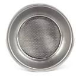

# Básicos del Barista Domestico

PRIMERA EDICIÓN - ABRIL - 2020

## EL INICIO Y LAS MIL Y UNA DUDAS

_**Me gusta el café, me gustaría preparar en casa un café como el de los bares pero que esté rico, ¿qué tengo que hacer?**_

Esta suele ser la pregunta con la que todos hemos empezado en esta afición de preparar un café rico en casa. Es casi seguro que tengamos en casa una Nespresso y al principio eso nos pareciera “lo más” pero poco a poco nos ha ido surgiendo la duda de si realmente esos cafés están buenos y si existe una manera de hacer un café más rico en casa o más ecológico o incluso que puede que más barato. Hay muchas motivaciones por las que podemos llegar a buscar una alternativa a las cápsulas.

El problema es que nos encontramos muy perdidos con un montón de preguntas y nadie cerca a quién preguntarle.

¿Se puede hacer un café rico en casa?

¿Qué tipos de cafés se pueden preparar?

¿Hay distintos tipos de cafés?

¿Están buenos los cafés en grano que venden en el súper mercado?

¿necesito una máquina?

¿es muy cara?

¿necesito más cosas aparte de una máquina y café en grano? ¿puedo molerlo con un molinillo de cuchillas?

… y muchas preguntas más que surgen cuando se avanza.

**LA GUÍA**

En esta guía voy a tratar de responder a todas esas preguntas de manera lo más ordenada y directa posible, dando opciones concretas de compra siempre que pueda. En algunos puntos se llega un poco más allá de la “iniciación” pero me ha parecido interesante explicar cosas que nos vamos a preguntar cuando no seamos tan noveles.

No se trata de un libro sino de una guía práctica. Si se busca un libro para iniciarse en el café recomiendo “El arte del café” de Sebastián Racineux y otros.

Si el lector quiere profundizar en la elaboración de un buen café en casa puede registrarse en [www.forocafe.es](http://www.forocafe.es/) donde me encontrará como @miwesly junto a otros usuarios de los que he aprendido gran parte de lo que explico aquí sobre la preparación del café en casa.

También puede contactar conmigo por email en

[josemaria.garcia.manero@gmail.com](mailto:josemaria.garcia.manero@gmail.com)

José María García es un simple aficionado doméstico al café. Esta obra se publica sin interés comercial y puede ser libremente compartida así como generar otras obras a partir de ella si se publican de la misma manera.

Este obra está bajo una licencia de

 [Creative Commons Reconocimiento-CompartirIgual 4.0 Internacional](http://creativecommons.org/licenses/by-sa/4.0/).

## QUÉ CAFÉS PUEDO PREPARAR EN CASA

_Italiana o Moka, filtro en V60, Aeropress, prensa francesa, café americano, capuchinos y por supuesto “espresso”_

Es más que probable que hayamos llegado a este manual porque queremos hacer un café en casa “como el del bar”, es decir, un espresso o un cortado, y reneguemos de uno de esos “aguachirle” de cafés americanos o de “pucherete”. Es normal pensar así pero tenemos que saber que estamos en un error y que las personas que más entienden de café lo toman en todas sus formas de preparación. Es más, las catas de café no se hacen con un espresso, se hacen con café filtrado.

Cada forma de preparación del café nos va a aportar cosas diferentes. Los cafés preparados “en filtro” facilitan la identificación de aromas y permiten disfrutar del café durante un rato largo mientras que el espresso es todo intensidad en dos sorbos.

Dicho lo cual, reconozcámoslo, aquí hemos llegado por el espresso, así que al espresso voy a dedicar la mayor parte del contenido, sin dejar de hacer un breve repaso por los métodos de preparación en filtro con los que recomiendo disfrutar un café de vez en cuando.

El café en casa se puede preparar con muchos métodos pero aquí voy a repasar los siguientes:

|  | Italiana, Moka o Bialetti |
| :--- | :--- |
|  | V60, filtrado “en cono” |
|  | Moccamaster, filtrado en máquina |
|  | Aeropress |
|  | Prensa francesa |
|  | Espresso, americano, cortado, capuchino... |

## EL CAFÉ

_Sin lugar a dudas lo más importante_

Me voy a detener un poco para hablar sobre el café porque aunque parezca una cosa de perogrullo muchas personas tardamos en entender que la calidad del grano es lo más importante para obtener un buen café, no es ni el método de preparación ni la máquina ni el molino, lo más importante de todo es la calidad del grano. Con un grano malo difícilmente vamos a obtener un café bueno y al revés ocurre algo similar, que aunque cometamos errores en la preparación o no contemos con las máquinas más caras si usamos un grano de buena calidad podemos obtener resultados bastante buenos.

El café tenemos que comprarlo en grano, tostado reciéntemente \(para filtro si puede ser del día anterior, para espresso menos de un mes\) y molerlo al momento, justo antes de prepararlo.

No debemos comprar café molido ni siquiera en tostadores reputados porque el aroma de un café recién molido no tiene nada que ver con un café molido hace días. Para moler un café para filtro no es imprescindible un molino caro, se puede utilizar un molino modesto y para espresso no nos va a servir el molido del tostador como veremos más adelante, así que el café en grano siempre.

¿Qué tipos de café hay? ¿qué compro y dónde?

Podréis ver que es habitual leer sobre cafés “arábicas” versus “robusta” y luego escuchar hablar de términos como “natural” o “etiopía”, “colombia”, “brasil”, “blends”... esto nos genera cierta confusión.

Arábica o Robusta hace referencia a la especie de la planta que da el café ya que no todo el café viene de la misma especie de planta. Por lo general los cafés “arábica” son más aromáticos y delicados mientras que los cafés “robusta” son más planos, con más sabores amaderados.

Un café arábica no tiene por qué ser mejor que un robusta por el mero hecho de ser arábica, hay arábicas muy malos, pero la realidad es que al ser las plantas “robusta” más fáciles de cultivar se genera a nivel mundial mucho café “robusta” de mala calidad que “robusta” de buena calidad.

Por otro lado tenemos el origen del café en función del país de procedencia del grano, Etiopía, Kenia, Colombia, Brasil, etc. o cafés donde se ha realizado una mezcla o “blend”. Se suele esperar determinadas características de un café en función de su origen, pero esto escapa del objeto de esta guía.

Si vamos a preparar un café para filtro aconsejo comenzar por un 100% arábica mono origen de tostadores reputados tostado expresamente para filtro. Si vamos a preparar espresso podemos probar con tuestes más altos, con blends que lleven algo de robusta, con 100% arábicas o incluso hay algunos cafés 100% robusta, iremos probando para ver cuáles se ajustan mejor a nuestros gustos.

Otro punto de confusión sobre el café es el término “natural”. Se suele utilizar para indicar que durante el tueste no se ha añadido azúcar al grano, proceso que da un café denominado “torrefacto” cuyo aspecto es el de una canica negra. No confundir con el término “torrefacción” que es un sinónimo de tostar. Poco a poco se va dejando de usar café torrefacto porque es un proceso que aporta mucho amargor y malos sabores al café pero como al mismo tiempo aporta color todavía muchas personas creen que un buen café debe ser muy negro.

Dentro del café de especialidad el término “natural” no se usa para referirse al proceso de tueste sino para hacer referencia al proceso de secado de la cereza del café. Se habla del proceso “natural”, proceso “lavado” y proceso “honey”.

Hay muchos tostadores a los que comprar café y pedirles consejo. Si tenéis tostadores locales aconsejo visitarles y así podréis ver los distintos cafés que tuestan. Es divertido y enriquecedor hablar en persona de cafés con los tostadores locales.

Por Internet se puede comprar en muchos sitios. A continuación un listado de sitios donde comprar, seguro que me dejo muchos tostadores pero en estos he comprado y son de la máxima calidad

[https://puchero.coffee/](https://puchero.coffee/)

[https://nomadcoffee.es/coffee/](https://nomadcoffee.es/coffee/)

[https://www.cafesanagustin.com/](https://www.cafesanagustin.com/)

[https://hola.coffee/](https://hola.coffee/)

[https://larendicion.es/](https://larendicion.es/)

[https://specialtymountaincoffee.com/](https://specialtymountaincoffee.com/)

[https://www.cafeselmagnifico.com/](https://www.cafeselmagnifico.com/)

[https://www.ecafe.es/](https://www.ecafe.es/)

[https://www.dorigencoffee.es/](https://www.dorigencoffee.es/)

[https://www.rightsidecoffee.com/](https://www.rightsidecoffee.com/)

[https://ineffablecoffee.com/](https://ineffablecoffee.com/)

[https://www.torchcoffee.eu/](https://www.torchcoffee.eu/)

[https://flococoffee.com/](https://flococoffee.com/)

Mr. Chava \(no tiene web\) - Pedidos por whatsapp 639652485

La página “El gato barista” mantiene un listado de tostadores y cafeterías de toda España que recomiendo consultar.

COSTE DEL CAFÉ

¿Cuánto cuesta el café bueno? Será más barato que una cápsula de Nespresso, ¿no?

El café “bueno” no es barato. Se suele vender en paquetes de 250 gramos o de 340 gramos. Un paquete de 250 gramos de café de buena calidad varía entre los 7,5 euros y los 12 euros. Un precio promedio aceptable para 250gr serían 9 euros lo que nos da un precio de 36 euros el kilo.

¿Es esto caro?

Un café de filtro para una persona se suele hacer con 9 gramos de café. Esto nos da unos 110 cafés por kilo lo que son 32 céntimos cada café. En espresso es habitual cargar 18 gramos para dos espressos de 18 gramos cada uno. Tenemos por tanto la misma cuenta con 32 céntimos cada espresso, precio similar al de una cápsula pero usando mejor café.

¿Qué conclusiones podemos sacar?

Podemos deducir que gastar menos no es un motivo real para dejar la Nespresso. El motivo principal es la calidad de la bebida que vamos a obtener.

¿Por qué cafés empiezo?

Recomendar café es difícil porque hay bastante diferencias en función del grano, del tueste o del origen y porque los tostadores artesanos van rotando los tipos de grano que tuestan, con lo que van cambiando su oferta. No obstante voy a intentar proponer un pequeño itinerario de iniciación.

No todos los cafés de buena calidad \(no voy a emplear la palabra especialidad aquí\) tienen el mismo estilo, hay cafés que se parecen más al sabor del que sirven en el bar pero “con calidad” y otros cafés que tienen un sabor bastante diferente.

El sabor de un café clásico de buena calidad lo habremos podido probar tomando un espresso en Italia o en menor medida en algunas cafeterías de Portugal. Nos han puesto un café espresso, en taza pequeña, con un sabor muy intenso a café, con recuerdos a tabaco habano o a maderas pero con muy poco amargor y ninguna acidez. Podríamos comenzar nuestra andadura probando estos tipos de cafés, a los que solemos referirnos a veces como blends italianos o tueste de tipo italiano.

Tres tostadores italianos cuyos cafés merece la pena probar son Andrea Trinci, Alberto Trabatti \(Penazzi\) y Fabrizio Rinaldi. Los dos primeros suele comercializarlos ecafe.es, los cafés de Rinaldi son más difíciles de conseguir pero se le pueden pedir a Fabrizzio directamente. En este post se trataron algunos de los mejores tostadores italianos

[https://forocafe.es/foro/viewtopic.php?t=494](https://forocafe.es/foro/viewtopic.php?t=494)

No solo comercializan “blends”, también tuestan café mono origen y merece la pena darles un buen repaso a estos cafés de tueste más alto de lo habitual respecto a los cafés de especialidad que solemos encontrar en tostadores locales. Encontraremos en ellos más crema, menos acidez y sabores más propios del tueste más alto.

Podemos continuar este pequeño recorrido probando algún blend de especialidad de tostadores españoles, cuyo sabor ya empieza a ser diferente, comenzamos a tener más acidez y aromas más “delicados”. Un blend que está muy rico y es fácil de extraer es por ejemplo “Serra Gelada” de D’Origen o del mismo tostador “Healthy Habits”. Habitualmente encontramos sabores similares en los cafés de Brasil, por lo que puede ser un buen siguiente paso.

Y para adentrarnos en los sabores y aromas más distantes del café clásico podríamos comenzar con un café de Etiopía. En estos cafés vamos a apreciar más acidez, pero si están bien extraídos será una acidez agradable que le dé brillo al resultado. En estos cafés podemos percibir aromas como frutas tropicales, limón, melocotón, rosas. Si están bien extraídos son una delicia.

A partir de aquí ya serán los gustos y la propia experiencia la que vayan determinando qué cafés nos agradan más. A mi personalmente me gustan todos y disfruto con ellos si están bien extraídos.

## CAFÉ DE FILTRO

_La forma más sencilla de preparar un rico café_

EL MOLINO PARA FILTRO

No es necesario invertir en un molino caro para hacer café de filtro. Esto no ocurre en espresso como veremos más adelante, pero para hacer café de filtro servirá un molino modesto.

El molino deberá ser obligatoriamente de muelas. No se hace café con un molino de cuchillas. Para que el café salga rico es necesario que el molido sea uniforme. Un café donde el molino deje trozos muy grandes por un lado y polvo fino por otro hará que cuando esté en contacto con el agua los trozos gruesos no se disuelvan correctamente y queden “sub extraídos” mientras que el polvo fino se disolverá en exceso y dará sabores amargos porque quedarán “sobre extraídos”.

Si queremos un café equilibrado donde no apreciemos demasiado amargor o demasiada acidez o sabores extraños debemos tener un molido uniforme.

Si el bolsillo nos lo permite podemos invertir en un molino caro como por ejemplo un Comandante C40, que anda por los 250 euros pero que da un resultado espectacular y que en un momento dado también nos puede servir para espresso.

Otro molino de precio medio que da un magnífico resultado en filtro y que nos puede servir para espresso es el ROK, que ronda los 170 euros

Pero si tenemos poco dinero y queremos hacer café de filtro podemos optar por estos molinos

TABLA DE MOLINOS PARA FILTRO

<table>
  <thead>
    <tr>
      <th style="text-align:left">MOLINOS MANUALES</th>
      <th style="text-align:left"></th>
    </tr>
  </thead>
  <tbody>
    <tr>
      <td style="text-align:left">
        
      </td>
      <td style="text-align:left">
        
Hario Mini Mill - 30 euros

        
Un molino sencillo que hace su trabajo

      </td>
    </tr>
    <tr>
      <td style="text-align:left">
        
      </td>
      <td style="text-align:left">
        
Hario MXR2TB - Entre 45 y 80 euros

        
Es bonito y con una goma que lo fija para facilitar el agarre. Precio
          muy variable

      </td>
    </tr>
    <tr>
      <td style="text-align:left">
        
      </td>
      <td style="text-align:left">
        
Porlex Mini - 56 euros

        
Un gran molino manual a pesar de su tama&#xF1;o. Muele muy homog&#xE9;neo,
          es muy eficaz y f&#xE1;cil de transportar

      </td>
    </tr>
  </tbody>
</table>

Molinos estupendos pero algo más caros

<table>
  <thead>
    <tr>
      <th style="text-align:left">
        
      </th>
      <th style="text-align:left">
        
CrushGrind Brazil - 70 euros

        
Buen molino con un original sistema de fijaci&#xF3;n para facilitar la
          molienda

      </th>
    </tr>
  </thead>
  <tbody>
    <tr>
      <td style="text-align:left">
        
      </td>
      <td style="text-align:left">Handground - 88 euros</td>
    </tr>
    <tr>
      <td style="text-align:left">MOLINOS EL&#xC9;CTRICOS</td>
      <td style="text-align:left"></td>
    </tr>
    <tr>
      <td style="text-align:left">
        
      </td>
      <td style="text-align:left">Melitta 1019 - 47 euros</td>
    </tr>
    <tr>
      <td style="text-align:left">
        
      </td>
      <td style="text-align:left">
        
Krups GVX242 - 49 euros

        
Un cl&#xE1;sico molino el&#xE9;ctrico de entrada al mundo del caf&#xE9;
          dom&#xE9;stico de filtro

      </td>
    </tr>
  </tbody>
</table>

Los molinos eléctricos son cómodos pero tienen un problema, la retención. Se quedan con café en su interior que será desalojado con la próxima carga de grano que a su vez dejará retención. Este café retenido puede dar malos sabores en la siguiente taza, especialmente si se deja ahí para el día siguiente. Por este motivo soy más partidario de los molinos manuales para hacer café de filtro, no obstante si no nos gusta moler café, por menos de 50 euros tenemos muy buenas opciones, siempre pensando en café filtrado, no para espresso.

Si andamos más sobrados de presupuesto podemos mirar molinos manuales magníficos como por ejemplo

|  |  |
| :--- | :--- |
| Lido 2 o Lido 3 o Lido E | Helor 101 |
|  |  |
| Kinu M47 | 1zPresso K-pro y K-plus |

Estos molinos son caros pero nos pueden servir también para hacer espresso y esto es un valor a tener en cuenta.

PREPARACIÓN DEL CAFÉ DE FILTRO

No me voy a detener en explicar cómo hacer un café con las distintas cafeteras de filtro disponibles porque prefiero dedicar más espacio al espresso, pero haremos un breve repaso.

En general son sistemas muy sencillos con los que podemos pasar un tiempo experimentando con distintos niveles de grosor de la molienda, temperatura del agua y tiempo de infusión, así como el ratio café/agua.

Por ejemplo, en V60 se suele usar un ratio 1:16 lo que significa que si ponemos 10 gramos de café en grano debemos utilizar 160 gramos de agua durante la preparación \(en taza nos quedarán unos 140gr\)

Y ¿cómo sabemos cuánto pesa el café o cuánto pesa la bebida? Pues es absolutamente necesario disponer de una báscula.

No hace falta gastar más de 10 ó 12 euros pero la báscula es imprescindible tanto para hacer café de filtro como para espresso.

A continuación dejo algunos vídeos con consejos sobre cómo preparar café con los distintos métodos

Bialetti

[https://www.youtube.com/watch?v=rpyBYuu-wJI](https://www.youtube.com/watch?v=rpyBYuu-wJI)

V60

[https://www.youtube.com/watch?v=c0Qe\_ASxfNM](https://www.youtube.com/watch?v=c0Qe_ASxfNM)

Aeropress - [https://www.youtube.com/watch?v=ejfYzAm8Dzs&t=253s](https://www.youtube.com/watch?v=ejfYzAm8Dzs&t=253s)

Prensa francesa

[https://youtu.be/8UMSxf4R9aM](https://youtu.be/8UMSxf4R9aM)

Moccamaster

[https://youtu.be/B6GA-UePr2M](https://youtu.be/B6GA-UePr2M)

Para terminar con el café de filtro y para aquellos que no quieran gastar lo que cuesta una Moccamaster pero quieran un sistema eléctrico, dejo referencia de una cafetera eléctrica para una o dos tazas muy económica, sobre los 35 ó 40 euros y que da un magnífico resultado

Melitta Aromaboy

**¿El agua importa?**

Definitivamente el agua importa, tanto en la elaboración de cafés de filtro como en café espresso un gran porcentaje de la bebida que estamos preparando es agua, más de un 90%.

Si usamos un agua que tenga malos olores. malos sabores o mucha cal estos elementos se van a pasar al café y pueden a la larga dañar nuestro equipo.

Es recomendable usar un agua de buena calidad o utilizar filtros que mejoren la calidad del agua en caso de no querer usar agua mineral.

**¿Le puedo poner azúcar?**

Este es un asunto controvertido así que esto es solo mi opinión. Creo que no es pecado añadir 2 gramos de azúcar blanco o 4 gramos de azúcar moreno al café para tomarlo en casa.

Obviamente no vamos a poner azúcar al café en una cata, en un concurso o a ponerle dos cucharadas de azúcar para que el café pierda todo su sabor y solo sepa a azúcar, pero no veo ningún pecado en añadir por ejemplo dos gramos de azúcar a un café de filtro si nos agrada un punto más dulce en el café o si queremos compensar un poco una excesiva acidez o un punto de amargor fruto de una extracción imperfecta.

Si el café está bien preparado no será amargo y tendrá una acidez agradable, pero al menos yo no he probado nunca un café que me supiera dulce, ni quiera preparado por baristas expertos. He tomado cafés de filtro que estaban muy buenos sin azúcar, que no necesitaban que se les añadiera azúcar y que podría decirse que tiene un sutil dulzor, pero dulces lo que se dice dulces, no estaban. Si a uno le gusta que sepa dulce pues a mi me parece bien ponerle un poco de azúcar. No veo motivo para tomar una bebida que no sea de nuestro agrado sólo porque otros opinen que eso no está bien.

Personalmente nunca pongo azúcar en un espresso o en un café con leche, pero a veces añado dos o tres gramos de azúcar de caña en el café de filtro.

## CAFÉ EN SUPERAUTOMÁTICA

_El espresso por el camino corto_

Elaborar un espresso con una molino y una máquina es en realidad una afición. No sólo nos gusta el resultado, nos resulta entretenido todo el proceso de elaboración del café y disfrutamos con el proceso de pesar, moler, distribuir, prensar, extraer y degustar pero es posible que no queramos ser “baristas domésticos” sino simplemente tener un espresso de buena calidad.

Si este es nuestro caso, las máquinas superautomáticas son nuestra solución.

A la hora de elaborar el café estas cafeteras son todas muy parecidas pero su rango de precios varía sensiblemente, entre 260 y más de 1.000 euros.

Si vamos analizando la funcionalidad que van añadiendo a medida que suben de precio, van incluyendo cosas como el cremado automático de la leche mediante depósito, la posibilidad de usar café premolido, pantallas táctiles, recetas programadas, tareas de mantenimiento automatizadas, etc.

Cada cual puede decidir qué le aportan estas funcionalidades, desde mi punto de vista aportan muy poco. El único motivo por el que pagaría más dinero en una superautomática es por un molino mejor, nada más.

El cremado de la leche es muy sencillo utilizando una cafetera de émbolo o prensa francesa. Con este sencillo sistema de cremar la leche con una cafetera de prensa francesa se obtienen resultados profesionales, infinitamente mejores que los que consigue cualquier superautomática con depósito. Los modelos sin depósito vienen con una lanza que puede utilizarse para cremar correctamente la leche.

Si comprara una superautomática optaría por las más económicas, por ejemplo

|  |  |  |
| :--- | :--- | :--- |
| Krups Roma - 250 € | De’longhi Magnifica - 300 € | Cecotec Power Matic - 268 € |

Vídeo sobre cómo cremar leche con calidad profesional sin necesidad de máquina

[https://youtu.be/sUoltqLZzPQ](https://youtu.be/sUoltqLZzPQ)

## CAFÉ ESPRESSO

_Manos a la obra, qué necesitamos_

La mayor parte de las personas que nos interesamos por preparar buen café en casa tenemos en la mente un café solo con su crema o un cortado o un bonito capuchino si puede ser con un dibujo encima. Sólo tras un periodo de aprendizaje comprendemos que hay vida más allá del espresso pero al principio hacer un buen espresso es lo fundamental.

Tenemos que empezar la guía con malas noticias. Hacer un espresso correcto no es barato. Es necesario invertir en una serie de elementos que veremos a continuación sin los cuales no vamos a poder sacar un espresso “de libro”.

Hemos visto anteriormente que un café de filtro podemos prepararlo por poco más de 100 euros entre el molino, la cafetera y la báscula, pero en espresso la cosa es diferente.

Para hacernos una idea de qué estamos hablando, un equipo completo de gama media para hacer espresso nos puede salir por unos 1.400 euros. He subrayado “gama media” porque lógicamente tenemos la gama “de entrada” donde podremos tener un equipo completo por unos 400 - 500 euros y también podemos recurrir al mercado de segunda mano donde podemos conseguir un equipo completo a precios de saldo pero con un alto riesgo, sobre todo si somos novatos y no sabemos distinguir qué estamos comprando.

Vamos a ver qué necesitamos comprar para hacer café espresso.

<table>
  <thead>
    <tr>
      <th style="text-align:left"><b>ACCESORIOS</b>
      </th>
      <th style="text-align:left"></th>
    </tr>
  </thead>
  <tbody>
    <tr>
      <td style="text-align:left">
        
      </td>
      <td style="text-align:left">
        
<b>Una b&#xE1;scula</b>
        

        
Pesar el caf&#xE9; es IMPRESCINDIBLE

        
Es habitual en el usuario novel pensar &#x201C;esto lo hago yo a ojo&#x201D;
          pero el espresso requiere de la b&#xE1;scula si se quiere hacer correcto

      </td>
    </tr>
    <tr>
      <td style="text-align:left">
        
      </td>
      <td style="text-align:left">
        
<b>Un tamper del di&#xE1;metro adecuado</b>
        

        
Sirve para prensar el caf&#xE9;. La m&#xE1;quina traer&#xE1; uno de pl&#xE1;stico
          pero ese no sirve. El tamper debe tener el peso adecuado para prensar y
          aplanar correctamente el caf&#xE9;.

      </td>
    </tr>
    <tr>
      <td style="text-align:left">
        
      </td>
      <td style="text-align:left">
        
<b>Una jarra</b>
        

        
Si queremos hacer bebidas con leche necesitaremos una para &#x201C;cremar&#x201D;
          la leche y para verterla en el caf&#xE9;

      </td>
    </tr>
    <tr>
      <td style="text-align:left">
        
      </td>
      <td style="text-align:left">
        
<b>Unas tazas adecuadas</b>
        

        
Un espresso hay que sacarlo en tazas adecuadas, no vale el &#x201C;mug&#x201D;
          de publicidad de medio litro que tenemos en un mueble

      </td>
    </tr>
    <tr>
      <td style="text-align:left">
        
      </td>
      <td style="text-align:left">
        
<b>Un nivelador</b>
        

        
&#xC9;ste es opcional, pero ayuda a distribuir bien el caf&#xE9; en el
          portafiltros

      </td>
    </tr>
    <tr>
      <td style="text-align:left">
        
      </td>
      <td style="text-align:left">
        
<b>Un caj&#xF3;n &#x201C;picamarros&#x201D;</b>
        

        
Tambi&#xE9;n opcional, pero muy &#xFA;til para tirar ah&#xED; las pastillas
          de caf&#xE9; que salen del portafiltros

      </td>
    </tr>
  </tbody>
</table>

<table>
  <thead>
    <tr>
      <th style="text-align:left"><b>EL MOLINO Y LA M&#xC1;QUINA</b>
      </th>
      <th style="text-align:left"></th>
    </tr>
  </thead>
  <tbody>
    <tr>
      <td style="text-align:left">
        

          
        

        

          
        

      </td>
      <td style="text-align:left">
        
<b>Un molino adecuado para espresso</b>
        

        
En las fotos un molino de gama media-alta &#x201C;Niche Zero&#x201D; y
          un molino de gama de entrada &#x201C;Ascaso i-mini&#x201D;

      </td>
    </tr>
    <tr>
      <td style="text-align:left">
        
        
      </td>
      <td style="text-align:left">
        
<b>Una m&#xE1;quina de espresso</b>
        

        
Analizaremos m&#xE1;s adelante las principales opciones que tenemos respecto
          a qu&#xE9; m&#xE1;quina comprar.

        
En las fotos una m&#xE1;quina de gama alta &#x201C;Bezzera m&#xED;tica&#x201D;
          y una m&#xE1;quina de gama de entrada &#x201C;Delonghi Dedica&#x201D;

      </td>
    </tr>
  </tbody>
</table>

ACCESORIOS RECOMENDADOS

Si estamos comenzando podemos comprar accesorios que nos den una buena relación calidad precio. A continuación propongo algunos

**Báscula** **Zacro** precisión 0.01 - 12 euros

Una precisión de 0.1 es suficiente, pero personalmente prefiero esta báscula que mide hasta 0.01 por tan solo 12 euros en Amazon

**Tamper**

El tamper tiene distintos diámetros, antes de comprarlo debemos conocer el diámetro del portafiltros de nuestra máquina. Las máquinas de gama media - alta suelen tener filtros \(cestillos\) de 58mm mientras que las de entrada suelen tener filtros de 51mm. En Aliexpress podemos encontrar este tamper que yo mismo tengo y es de una calidad asombrosa.

También podemos comprar un tamper de la marca Motta pagando algo más, pero son de muy buena calidad.

En el mercado también se pueden encontrar tampers “dinamométricos” que supuestamente hacen siempre la misma presión

No he probado nunca un tamper caro como este

pero sí uno como este

y me resultó bastante inútil respecto a uno normal. Realmente si sigues apretando puedes ejercer toda la presión que quieras así que no le vi más ni menos utilidad que a un tamper corriente.

**Jarra**

Algunos usuarios noveles se pasan por el “chino de la esquina” y comprar una jarra ahí. Estas jarras no son adecuadas y dificultan la preparación de un buen café con leche.

Un jarra adecuada no cuesta demasiado dinero y merece la pena invertir en ella.

Recomiendo empezar con una jarra de 35 cl ya que es más sencilla de manejar que una jarra de medio litro.

Podemos comprar las jarras en

[https://www.complementosdelcafe.com/](https://www.complementosdelcafe.com/)

o en Amazon o Aliexpress. Sus precios están entre 8 y 15 euros, es algo que vamos a usar muchos años así que no tiene sentido escatimar en la jarra, recomiendo que compréis una que os guste y que sea de buena calidad.

**Tazas**

Las tazas de espresso buenas son algo caras \(entre 5 y 10 euros\), pero al igual que ocurre con la jarra es algo que vamos a usar muchos años y cuyo precio se va a diluir tanto en los cafés que merece la pena comprar unas buenas.

Una de las mejores marcas de tazas es ACME y se pueden encontrar también en Complementos del Café.

La taza de espresso por excelencia es la de la marca Illy, todo un clásico

Algunos aficionados al café, especialmente los principiantes, prefieren los vasos translúcidos de doble cristal como estos

Es una cuestión de gustos pero el café me gusta en taza de porcelana, veo una gran diferencia de tacto y sensación de calidad y calidez entre una buena taza de porcelana y un vaso de cristal.

En el término medio he utilizado alguna vez vasitos de la serie Picardie de Duralex de 9cl y no están mal, pero nada que ver con una taza ACME, Illy o similar

**Nivelador distribuidor**

El nivelador es un accesorio que no todo el mundo usa, lo he puesto como opcional, pero creo que es un accesorio conveniente. Cuando vayamos a sacar un espresso es importante que el café esté distribuido de forma uniforme en el filtro para que no haya partes por donde el agua no pase y otras partes por donde pase demasiada agua. También es importante que el café quede nivelado, es decir, que no quede una parte de la superficie más baja que otra porque el agua siempre busca escapar por la zona de menos resistencia.

Este accesorio nos ayudará tanto a distribuir el café adecuadamente como a nivelarlo antes de darle un suave prensado con el tamper.

Al igual que ocurre con el tamper es necesario conocer el tamaño de los cestillos de nuestra máquina, que a partir de ahora llamaremos filtros, para saber qué nivelador comprar.

La marca Motta también hace muy buenos niveladores, pero si no queremos gastar unos 30 euros en este complemento también podemos recurrir a marcas más económicas o simplemente distribuir con la mano y nivelar con el tamper que es algo que hacen muchos baristas con buenos resultados.

**Cajón de borras o picamarro**

Este complemento viene a costar unos 20 euros y a mi me parece de suma utilidad y comodidad.

Como alternativa podemos tirar las pastillas golpeando el cubo de la basura pero si es de plástico terminamos rompiendo el cubo. Si no queremos comprar el cajón recomiendo sacar la pastilla colocando una servilleta de papel en la encimera y golpear el porta sobre la servilleta. Así además podremos ver el aspecto de la pastilla. He hablado con baristas que dicen que mirar la pastilla no sirve de nada y con otros que me han dicho “la pastilla te lo dice todo”. Personalmente no presto atención al aspecto de la pastilla, pero si uno quiere verla bien pues el método de la servilleta de papel sirve para eso aparte de para ahorrarse el cajón.

**El molino y la máquina**

Dedicaré capítulos específicos al molino y a la máquina porque son los elementos más difíciles de elegir y donde más opciones diferentes tenemos.

## LOS FILTROS DE LA MÁQUINA DE ESPRESSO

_Filtros presurizados y no presurizados. Diámetro de los filtros. Dobles o simples. Filtros de competición_

Antes de hablar de los molinos o de las máquinas voy a dedicar un capítulo en exclusiva a hablar de los filtros o “cestillos” de las máquinas de espresso porque es una de las cuestiones que más dudas y preguntas suscita entre los principiantes. Esto es un filtro

es donde se pone el café molido para sacar un espresso y va insertado en el portafiltros que es esto

La primera duda, aunque no la más frecuente, es que no todos los filtros tienen el mismo diámetro. Las máquinas profesionales suelen llevar filtros de 58mm mientras que las máquinas de entrada suelen llevarlos de otros diámetros. Casi todas las máquinas de menos de 200 euros llevan filtros de 51mm, algunas máquinas como las Lelit de gama media llevan filtros de 57mm y algunas máquinas como La Spaziale Vivaldi S1 llevan filtros de 53mm. Si optamos por comprar una máquina con filtros de 58mm sabremos que tendremos más facilidad para encontrar recambios porque digamos que todo es “más estándar” en esa medida, pero esto no tiene más relevancia que esa. El diámetro del filtro no va a hacer que saquemos mejor café.

Sin embargo esta no es la principal duda de un principiante sobre los filtros. La principal duda es la del “filtro presurizado”. Vamos con ello.

**Filtros presurizados y filtros atmosféricos**

Un filtro normal es así por arriba

y así por la parte de abajo

Vemos que los agujeros que tiene visto desde arriba son los mismos que tiene visto desde abajo. Bien, esto es lo normal de un agujero, que se abre por arriba y se ve por debajo, sin embargo la mayoría de las máquinas de gama de entrada \(menos de 400 euros\) no traen filtro así, traen filtros que por debajo son así

Esto se llama un filtro “presurizado” y lo que el fabricante ha hecho es tapar con una fina chapa las salidas del filtro y dejar en esa chapa un pequeño número de agujeros, a veces incluso se deja un sólo agujero. Y ¿por qué hace esto el fabricante? Pues lo hace porque asume que no tenemos un buen molino y así podemos poner café toscamente molido que no hará la suficiente presión por sí mismo como para sacar crema pero de eso se encargará el filtro. Este sistema se va a encargar de generar de forma artificial la presión necesaria y sacará “café a presión” de forma que se genere “espuma” de café y de esta forma el resultado se asemeje visualmente a lo que es un espresso correcto.

Los filtros presurizados son una buena forma de comenzar a hacer espressos en casa usando buen café sin gastar mucho dinero en el molino de espresso que como veremos más tarde, es caro. Con un molino de los que hemos visto en el apartado “café de filtro” y un filtro presurizado podemos sacar cafés de aspecto parecido a los que hace una Nespresso pero utilizando grano de buena calidad, lo cual constituye ya un salto importante en la calidad del café que tomemos en casa.

Mi experiencia con los filtros presurizados es, no obstante, negativa respecto al uso de un buen molino y un filtro normal, también llamados “atmosféricos”. Cuando he puesto un molido lo suficientemente fino como para obtener una crema correcta, el filtro presurizado ha apelmazado el café en su interior generando una pastilla quemada y dando una taza poco equilibrada. Sí que he obtenido buenos resultados con cafés de tueste alto y espressos para tomar con leche.

Podemos comenzar utilizando estos filtros y un molino modesto \(que luego podemos usar para café filtrado\) y más adelante comprar un molino mejor y sustituir estos filtros por los atmosféricos. Los filtros atmosféricos son muy baratos y se pueden comprar de todos los diámetros.

A veces leeremos la expresión “despresurizar” el portafiltros o “despresurizar la máquina”. ¿De dónde proviene esta expresión si simplemente se trata de cambiar un filtro por otro? La expresión proviene de máquinas donde el presurizado no se hacía en la cestilla sino en el propio portafiltros y era necesaria una labor de bricolaje para eliminar el presurizado.

**Filtros dobles y filtros simples**

La tercera duda en relación a los filtros es si podemos usar el simple para hacer un solo café o debemos usar siempre el filtro doble. Un filtro simple es así

mientras que un filtro doble es así

La respuesta es difícil de asumir para el aficionado novel pero cuanto antes lo asuma, mejor para el café que obtenga en casa. Debemos usar el filtro doble siempre. El filtro simple podemos echarlo al cajón y olvidarnos de él.

Obtener un café correcto con un filtro simple es sumamente complicado. Algunos aficionados han conseguido obtener buenos cafés utilizando un filtro simple especial de la marca La Marzocco o de la marca IMS que tienen una estructura interior que permite prensar con un tamper de 41mm, pero hacer un café correcto con el filtro simple que suelen traer las máquinas usando el tamper de 58mm o de 51mm es misión imposible.

No es necesario fustigarse por ello, si tomamos café nosotros solos, un espresso doble tiene unos 36 gr lo que apenas llega a una taza de espresso de las pequeñas, no es una cantidad excesiva de café y si ponemos café de calidad la cantidad de cafeina de un espresso doble aún será la mitad de la que nos ponen en un café solo del bar.

**Los portafiltros Naked o bottomless**

La última duda respecto a los filtros es si debemos comprar un porta “naked”, es decir, un porta que expone la parte de abajo del filtro porque carece de vertederas.

Estos portafiltros son algo complicados de usar porque si no distribuimos bien el café en el filtro se producirán salpicaduras. Por el mismo motivo son convenientes de tener, porque nos ayudan a saber si estamos distribuyendo y tampeando bien el café. Además, es un espectáculo ver cómo sale el café y la crema que hacen.

## EL MOLINO PARA ESPRESSO

_Detrás de todo bueno espresso hay un buen molino_

Una de las sorpresa que nos llevamos cuando nos adentramos en la preparación de un café espresso en casa es que el café no se muele con un molinillo de cuchillas sino que se muele con un molino de muelas y además no sirve uno de los económicos sino que hace falta comprar un molino que muela con la suficiente finura y consistencia como para sacar un café espresso. Si nos hemos decidido por una máquina de gama baja vemos con sorpresa cómo los molinos para espresso más económicos sobrepasan el precio de la máquina.

Suele decirse que el orden de importancia para la elaboración de un buen espresso es grano, molino y al final la máquina. Esto es cierto, casi con cualquier máquina del mercado incluso con las más económicas se puede obtener un espresso correcto si se dispone de la experiencia adecuada y de un buen molino.

Cada euro que invirtamos en el molino estará bien invertido.

¿Qué modelos puedo ir mirando? He seleccionado estos seis modelos

Gama de entrada

<table>
  <thead>
    <tr>
      <th style="text-align:left">
        
      </th>
      <th style="text-align:left">
        
      </th>
      <th style="text-align:left">
        
      </th>
    </tr>
  </thead>
  <tbody>
    <tr>
      <td style="text-align:left">
        
Ascaso i-mini

        
240 &#x20AC;

      </td>
      <td style="text-align:left">
        
Iberital Challenge

        
150&#x20AC;

      </td>
      <td style="text-align:left">
        
Demoka GR-203

        
200 &#x20AC;

      </td>
    </tr>
    <tr>
      <td style="text-align:left">
        
      </td>
      <td style="text-align:left">
        
      </td>
      <td style="text-align:left">
        
      </td>
    </tr>
    <tr>
      <td style="text-align:left">
        
Eureka Mignon

        
280 &#x20AC;

      </td>
      <td style="text-align:left">
        
Lelit Fred

        
190 &#x20AC;

      </td>
      <td style="text-align:left">
        
Sage Smart Pro

        
270&#x20AC;

      </td>
    </tr>
  </tbody>
</table>

Los precios indicados son orientativos y en algún modelo como el Mignon sólo aplica a un determinado modelo \(consultar las páginas de Maxicoffee y Elektros\)

Todos estos molinos son de muy buena calidad y sirven para espresso. Entre todos ellos al precio que indico mi elección sería el Eureka Mignon.

La diferencia más apreciable respecto a molinos de gama superior es el nivel de ruido y la velocidad con la que muelen. Los molinos más caros también muelen de forma más homogénea pero esto no es tan fácil de percibir como el ruido o la velocidad.

Otra característica que comparten estos molinos \(excepto el Sage que tiene regulación por pasos\) es que son muy precisos en el ajuste de sus muelas, sus muelas pueden acercarse o alejarse cuando queramos de manera milimétrica, no por pasos o niveles. Esto es bueno desde el punto de vista de la precisión pero se consigue mediante un tornillo sinfín que hay que estar girando durante un tiempo para realizar cambios en el nivel de molido, cosa que supone un inconveniente si queremos cambiar de café cada pocos días. Son molinos pensados para llenar la tolva con unos 100 gramos y gastarlos, no para ir poniendo cada día un café distinto.

Algunos de estos molinos tienen muelas planas y otros tienen muelas cónicas. En principio esto no debe preocuparnos, no vamos a notar una diferencia apreciable en la taza por el hecho que las muelas sean cónicas o planas.

|  |  |
| :--- | :--- |
| Muelas cónicas | Muelas planas |

Una opción que considero muy interesante si hacemos pocos espressos al día es utilizar un molino manual de los que vimos en el apartado “café de filtro” pero de los de la gama media o media alta.

Personalmente hago café espresso a diario utilizando el molino ROK y es una maravilla poder moler los gramos del café que quiero sin tener retención. Como referencia el molino muele 16 gramos en unas 55 vueltas.

Es habitual preguntarse si se puede hacer un espresso con molinos económicos como el melitta o el krups vistos en el apartado de filtro. También se suele preguntar por el Gaef 700. Ninguno de esos modelos son recomendables para espresso, en el caso de Graef parece que sí es adecuado el CM800 pero no lo he probado personalmente.

**Gama media alta**

Nos puede parecer un despilfarro invertir más de 500 euros en un molino, pero si realmente estamos interesados en sacar buenos espressos es conveniente invertir en el molino al máximo de nuestras posibilidades.

En casa, además del ROK, utilizo para diario un Ceado e37 que pude adquirir a un precio muy ventajoso, una auténtica bestia parda moliendo café. Es una delicia escucharlo moler y creo que vale cada euro que me costó

Hay que tener en cuenta que tanto la máquina como el molino nos van a durar muchos años y que invertir digamos 500 euros en el molino es probablemente un importe equivalente a lo que vamos a gastar en café en un año. Si disponemos del efectivo o de una financiación a un tipo interesante y queremos llegar a ser unos buenos baristas domésticos es importante invertir en un buen molino.

Vamos a proponer dos molinos cuyo precio roza los 600 euros.

El primero es un molino salido de un proyecto de crowdfunding que buscaba producir un molino con suficiente calidad para espresso y sin retención. Se trata del Niche Zero

El segundo candidato es el Baratza Sette 270wi, un molino que además nos pesa el café que va poniendo en el porta

Ambos son muy buenos pero si puedo elegir, me quedo el Niche Zero.

**El mercado de ocasión**

Existe un interesante mercado de ocasión tanto en máquinas de espresso como en molinos pero incluyo este apartado dentro de los molinos por que el mercado de segunda mano proviene fundamentalmente de la hostelería. Las máquinas de hostelería sólo son apropiadas para el mercado doméstico si son de un grupo, cosa que ya es raro y además suelen venir bastante maltratadas y mal mantenidas. Es un riesgo grande comprar una máquina usada que haya estado en un bar.

Sin embargo con los molinos la historia cambia porque casi cualquier molino profesional cabe en una cocina doméstica y aunque vengan maltratados y sucios suelen quedar como nuevos con una buena limpieza. Los molinos no tienen el problema de acumulación de cal que tienen las máquinas así que es menos probable que estén inservibles.

Por otro lado los molinos pequeños como el Iberital Challenge, el Ascaso Mini o el Compak k3 se suelen usar en los bares para el descafeinado que tiene un consumo mucho menor que el café con cafeína por lo que suelen ser molinos con menos uso que los molinos grandes como por ejemplo el Compak k6.

No es en absoluto un gran riesgo comprar uno de los modelos que hemos visto de la gama de entrada por un precio alrededor de 50 euros y hacerle una buena limpieza. Podemos tener molino para rato por cuatro veces menos de lo que cuesta nuevo.

**El dispensador**

Una duda habitual al comprar un molino de segunda mano es si buscamos uno con dispensador o uno “on demand”. El recipiente que lleva este molino a la salida del café es un dispensador

Es un elemento muy útil en el bar porque facilita poner muchos cafés seguidos pero en casa sólo nos aporta incomodidad. Obviamente nunca debemos usarlo para llenarlo de café molido para unos días, pero sí podemos tener un molino con dispensador y sacarle el café que molamos usando una brochita. Es incómodo pero es una opción que puede resultar muy económica porque hay muchos molinos de bar con dispensador a precios de salgo a veces por menos de 30 euros. También podemos quitarle el dispensador y ponele en la salida algún elemento que canalice el café.

**La tolva y el “single dosing”**

La tolva es el recipiente donde ponemos el café en grano.

¿Debemos llenar la tolva o debemos poner sólo el café que vayamos a consumir? Esta es una interesante pregunta.

Lo ideal es moler sólo el café que vamos a consumir, esto se conoce como “single dosing”, sin embargo en un molino “normal” no es fácil moler sólo el café que vamos a consumir por dos motivos, el primero es porque estos molinos tienen “retención”, es decir, que en su mecanismo se queda algo del café que estamos moliendo y el segundo motivo es que estos molinos muelen de manera más consistente y fina cuando tienen peso encima del café que estamos moliendo, es decir, cuando tienen la tolva llena con algo de café.

Hay molinos especialmente diseñados para single dosing, en el apartado de molinos ya vimos el Niche Zero o como ejemplo también tenemos el Ceado E5SD

Son molinos caros, el Niche ya hemos visto que cuesta casi 600 euros y los Ceado SD están entre 800 y 1.000 euros.

Podemos intentar hacer single dosing con un molino “de tolva” intentando extraer el café retenido con una brocha y cerrando las muelas hasta conseguir el nivel de finura necesario, aún sabiendo que tendrá que estar el molino más cerrado que si cargamos la tolva con 100 gramos por ejemplo.

También podemos invertir en un molino manual que sirva para espresso, que no será barato, pero nos permite hacer single dosing. y dejar el molino eléctrico para el café “blend” de diario. Es cuestión de que cada uno vaya realizando pruebas con su molino y su máquina.

## 

## LA MÁQUINA PARA ESPRESSO

_La decisión estrella, ¿qué máquina me compro?_

La máquina es lo primero que nos ponemos a buscar cuando decidimos que queremos hacer espresso en casa, pero como hemos visto anteriormente es más importante el molino.

La elección de la máquina es aún más complicada que la del molino porque existen diferentes tipos de máquinas con diferentes tecnologías y diferente funcionalidad.

**Sobre los “bares” de presión**

Antes de continuar tenemos que hablar un poco sobre los anuncios que hacen las máquinas modestas resaltando sus “19 bares” como si esto fuera bueno. No es bueno presionar la pastilla de café con 15 ni con 19 bares de presión, la presión “canónica” para extraer el café en una máquina profesional son 9 bares y las máquinas profesionales tienen unas válvulas \(las OPV\) destinadas a controlar que la presión dentro del porta no supere el nivel que haya regulado el fabircante aunque la bomba que traiga la máquina genere más presión.

¿Por qué entonces se anuncian las máquinas como si más bares de presión fuera mejor? Simplemente porque los consumidores creen que más presión es mejor. No hay otro motivo, pero es justamente al contrario, más presión hace que el agua aplaste la pastilla de café y se generen sabores no deseados, por eso las máquinas profesionales traen sistemas de control de la presión.

**MÁQUINAS ECONÓMICAS**

Vamos a comenzar revisando las máquinas más económicas. En este nivel previo al de entrada que podríamos fijar en “hasta 200 euros”, las máquinas son todas similares en cuanto a funcionalidad, son máquinas que por lo general tiene una pequeña caldera o un termobloque, filtros presurizados de 51mm y sin control de la presión \(la Kottea es una excepción\)

Estas son algunas cafeteras con las que podremos hacer buenos cafés:

|  |  |  |
| :--- | :--- | :--- |
| Minimoka 1821 | Cecotec Espresso 20 | De’longhi Dedica |
|  |  |  |
| Kotea C106 de Maxicoffee |  |  |

Como vemos la Minimoka y la Cecotec son la misma máquina, también casi idéntica a la Solac CE4480 o la Ufesa CE7240, son todas la misma máquina. Si esperamos alguna oferta podemos comprarlas por unos 70 euros. Son cafeteras bastante cómodas y vienen con filtros presurizados que tan sólo tenemos que cambiar por un filtro doble de 51mm “non pressurized” que cuesta unos 3 ó 4 euros cuando nos cansemos de jugar con los filtros presurizados. Realmente no le veo ningún inconveniente en empezar la afición con una de estas máquinas y un buen molino.

La De’longhi Dedica es una cafetera que suele salir por unos 150 euros y es una estrella de ventas en el nivel de máquinas económicas. Es una cafetera que combinada con un buen molino puede dar muy buenas tazas.

Cambiarle el filtro por uno doble no presurizado se puede hacer pero tiene un pequeño problema fácil de resolver. El filtro atmosférico es un poco más profundo que el que trae de serie la máquina y toca en la pieza de plástico que canaliza el café en el porta. En la imagen inferior vemos como el porta lleva dentro una pieza plástica donde tocará el filtro atmosférico al ponerlo. Esa pieza es fácilmente extraíble y sólo tenemos que rebajar un poco el plástico donde toca el filtro para que éste entre sin problemas. Con esa sencilla operación podremos tener nuestra Dedica “despresurizada”.

La máquina “Kottea” que vende la tienda francesa Maxicoffe es sin lugar a dudas la mejor máquina que podemos adquirir en el nivel de entrada. Cuesta unos 150 euros y sus características son impresionantes para una máquina de ese precio.

Es una máquina con filtros de 58mm, portafiltros compatible con el de las máquinas profesionales, válvula OPV para control de la presión y válvula de 3 vías \(ya veremos qué es esto\). Características todas ellas de máquinas que cuestan cuatro veces más caras. Sí hay que tener en cuenta que no tiene caldera sino termobloque y que no está construida en acero inoxidable sino en plástico, pero por 150 euros es una máquina de prestaciones muy superioresa las demás de su precio.

**Cremar leche**

Cremar leche correctamente con estas máquinas no es sencillo pero es perfectamente posible. Para generar vapor se pulsa un botón que hace que la resistencia de la caldera caliente el agua hasta convertirla en vapor. Una vez generado el vapor podemos calentar la leche en la jarra usando la lanza de la máquina y si tenemos la técnica adecuada podemos “cremar” o “texturizar” la leche.

Este proceso consiste en meter aire en la leche y posteriormente hacerla girar para que las burbujas se vayan convirtiendo en microburbujas a la vez que la leche se va calentando.

Tenemos que saber que estas máquinas suelen traer en la lanza un tubo llamado “panarello” y que cremar la leche con este tubo puesto es misión imposible. Debemos retirarlo y dejar la lanza desnuda.

Cuando se termina el proceso debemos volver a llenar la caldera de agua, recordemos que el agua que había dentro se ha convertido en vapor. Apagaremos el botón del vapor y con el botón apagado sacaremos agua por la lanza y por la ducha de la máquina. De esta forma la caldera vuelve a quedar llena de agua.

En este vídeo podemos ver cómo cremar leche con una cafetera de gama económica retirando el panarello, en este caso una de las que venden en Aldi, si bien el barista carece de la técnica de vertido para hacer un dibujo correcto.

[https://youtu.be/xoCwuwY\_mso](https://youtu.be/xoCwuwY_mso)

NIVEL DE ENTRADA

Las máquinas de nivel de entrada están entorno a los 500 euros. Sus características suelen ser:

* Máquinas de una caldera
* Construidas en acero inoxidable
* Válvula de Control de Presión que suele ser no regulable por el usuario \(OPV\)
* Válvula de tres vías o solenoide
* Portafiltros con “vertederas”
* Lanza de vapor más parecida a las profesionales

**La válvula “OPV”**

Una de las principales características que incorporan las máquinas según suben su precio es la OPV.

La Over Pressure Valve es una válvula que se encarga de devolver agua al depósito cuando la presión del circuito supera cierto nivel. Suelen funcionar con un muelle que mantiene la válvula cerrada mientras no se venza su resistencia, cuando la presión supera la resistencia del muelle la válvula se abre y desaloja agua hacia el depósito, manteniendo así una presión constante en el circuito.

En el siguiente esquema podemos ver cómo funciona una OPV. Al aumentar la presión en el circuito se vence la resistencia del muelle y el agua escapa de la válvula de vuelta al depósito de la máquina.

En algunas máquinas estas válvulas son regulables por el usuario mediante un tornillo que regula la presión del muelle. En las máquinas de precio medio es habitual que la válvula no sea regulable o si lo és, que esté poco accesible y sea necesario desarmar la máquina para llegar a ella.

|  |  |
| :--- | :--- |

**La válvula solenoide**

Esta es una característica fundamental para toda máquina que se precie. Es una válvula que desaloja la presión que se produce en el porta y lleva el agua sobrante de la extracción a la bandeja de la máquina.

Aspecto de la válvula de 3 vías

En la siguiente página hay una serie de esquemas que explican muy bien cómo funciona

[http://www.espressomyespresso.com/3way/intro.html](http://www.espressomyespresso.com/3way/intro.html)

Esta válvula no solo es una característica deseada por el hecho de que libere la presión del porta sino que es un elemento fundamental en la limpieza de la máquina.

Esta válvula hace que la presión que hay en el porta “suba” por la ducha y baje hasta la bandeja. Esto lo aprovecharemos para poner en el porta un filtro “ciego” \(sin agujeros\) de manera que esa válvula termine llevando agua limpia hacia arriba en lo que se conoce como un retrolavado.

También se puede poner detergente \(el más famoso se llama Puly\) en el filtro ciego y hacer una limpieza con jabón.

En este vídeo vemos cómo hacer retrolavados con jabón en una Gaggia Classic que es una cafetera que tiene dicha válvula en todos sus modelos excepto el de 2015 donde no la lleva y por tanto no puede limpiarse la máquina con esta técnica.

[https://www.youtube.com/watch?v=4mqS-EUOj5w](https://www.youtube.com/watch?v=4mqS-EUOj5w)

**Portafiltros con vertederas**

Desconozco cuál es el motivo pero en las máquinas de entrada el porta suele tener dos agujeros como estos

mientras que según sube el precio vamos viendo portafiltros como este

y las máquinas de gama más alta se suelen ver más así

**Lanza de vapor**

El aspecto de la lanza es una de las mayores pistas sobre la calidad de la máquina.

Las máquinas modestas suelen tener este aspecto, con el clásico tubito o panarello

En máquinas de gama media comenzamos a ver lanzas de vapor como estas

**Máquinas “entry level”**

En la gama de entrada ya comenzamos a tener más variedad para elegir.

A continuación algunas de las máquinas más vendidas.

|  |  |  |
| :--- | :--- | :--- |
| Gaggia Classic 2018 | Rancilio Silvia v6 | Lelit PL41TEM |
|  |  |  |
| Ascaso Dream |  |  |

Estas máquinas están entre 450 y 550 euros. Personalmente la que menos me gusta es la Ascaso Dream y las que más me gustan son la Silvia y la Lelit. En el caso de la Lelit también podemos encontrarla sin control de temperatura \(PID\) por unos 400 euros y con una lanza más modesta, pero creo que merece la pena pagar un poco más y tener una mejor lanza y un sistema de control electrónico de la temperatura del agua.

Finalmente hay una opción que me parece perfecta para quien quiera tener una buena máquina y un buen molino, a un precio estupendo, es la Lelit PL42. La tenemos en 500 euros sin PID y en 600 euros con el control de temperatura \(PID\)

La gaggia no es mala opción si vamos buscando el menor precio para una máquina de gama media. En la versión de 2015 hicieron una máquina realmente mala pero en esta versión de 2018 han vuelto a hacer una máquina con características correctas para su precio \(440 euros\)

He dejado dos hueco libres porque realmente por debajo de 500 euros no conozco nada mejor que la Silvia o la Lelit.

**GAMA MEDIA**

En la gama media vamos a ver máquinas entre 500 y 2.000 euros y además comenzamos a ver cambios técnicos en las máquinas respecto a las económicas y a las de nivel de entrada. Revisemos primero esos cambios técnicos antes de ver máquinas.

**Calderas**

Las calderas de las máquinas económicas y las “entry level” son pequeñas y se ubican justo encima del “grupo” que es por donde sale el café, son algo así

Sin embargo en máquinas de gama media y alta las calderas suelen estar separadas del grupo y comunicadas mediante tuberías.. Además suelen estar aisladas térmicamente. En la siguiente foto vemos la caldera de una ECM Classika. El tamaño de la caldera es mayor, ya no está puesta encima del grupo, está conectada con él mediante dos conductos y lleva un aislamiento que ayuda a mantener la estabilidad térmica.

**Control electrónico de la temperatura \(PID\)**

Otra de las características que suelen incorporar las máquinas de gama media es el control continuo de la temperatura del agua en la caldera que además puede ser determinada por el usuario. Esto se denomina PID y es una característica muy buscada porque ayuda a sacar cafés de forma consistente.

**Máquinas con intercambiador de calor HX**

En este rango de precios comenzamos a ver algunas máquinas cuya caldera no es un simple cilindro con una resistencia sino que llevan un ingenioso sistema que permite generar agua caliente en el grupo y vapor en la lanza al mismo tiempo y sin necesidad de tener una caldera separada para cada cosa.

Este sistema se denomina heat exchanger y estas máquinas se suelen conocer por ese motivo como máquinas HX.

Suelen ser más económicas que las de doble caldera y también suelen traer un sistema de control de la temperatura en la caldera pero esto lo hacen de manera indirecta. En realidad lo que hacen es modificar la presión que hay en la caldera y de esta forma modifican la temperatura indirectamente.

En estas máquinas la temperatura en la caldera está por encima de 100 grados ya que la caldera está siempre llena de agua y vapor y a través de ella pasa un cilindro que es el que lleva el agua fresca desde el depósito hasta el grupo y que calienta el agua por el hecho de pasar a través de una caldera a más de 100 grados. .

En el siguiente esquema podemos comprender cómo funciona

Como podemos ver, en estas máquinas el agua que hay en la caldera no es la que tomamos en nuestro café sino que es la que sale por la lanza de vapor. El agua del café proviene directamente del depósito a través de la bomba y se calienta al pasar por el intercambiador de calor que atraviesa la caldera.

Estas máquinas por tanto no requieren que se pulse “el botón” para generar vapor ni que luego se haga el purgado para volver a llenar de agua la caldera como ocurre en las que hemos visto hasta ahora, que dicho sea de paso se denominan “single boiler”.

En la siguiente foto vemos una caldera cortada por la mitad y también el intercambiador cortado. El agua proviene de la bomba por el tubo de cobre y debido a la presion sale por el otro. Se calienta al pasar por dentro de la caldera.

**Grupo E61**

El grupo, como ya habrá deducido el lector, es el conjunto por donde sale el café en el cual se ubica también la “ducha” que es ya el último elemento por donde pasa el agua antes de tocar la pastilla.

La empresa Faema lanzó en 1961, año de un eclipse, una máquina histórica que denominó E61 y que tenía bastantes innovaciones técnicas entre las cuales estaba un grupo con este aspecto

Este grupo fue diseñado originalmente para mantener la temperatura correcta en el sistema HX pero hoy en día, dado que la patente está vencida, lo montan máquinas de distintas marcas que no son del grupo Cimbali \(actual propietario de Faema\) e incluso se monta en muchas máquinas que no son HX.

Para comprender el funcionamiento de un grupo E61 recomiendo la lectura de esta página

[https://foodal.com/drinks-2/coffee/espresso-machines/e61-group-heads/](https://foodal.com/drinks-2/coffee/espresso-machines/e61-group-heads/)

Se ha escrito mucho sobre los beneficios “en taza” del grupo E61. No es objeto de este manual entrar en esta materia, pero sí mostrar esta pieza que es casi un estándar en las máquinas de gama media.

**Manómetro y termómetro de grupo**

El manómetro es el indicador de la presión que el agua está haciendo contra la pastilla de café y cuyo valor “canónico” son 9 bares. Disponer de manómetro no es una característica exclusiva de las máquinas de gama media, pero sí que es más común que una máquina de este precio venga con indicadores de presión en el porta y en caso de las HX indicador de presión en la caldera.

Algunas de estas máquinas también incorporan o pueden incorporar un termómetro de grupo para saber a qué temperatura está llegando el agua al café.

**Grupo de 58mm, duchas y filtros de competición**

Casi todas las máquinas de este nivel usan portafiltros de 60mm para filtros de 58mm de manera que las piezas y los portas son intercambiables entre las máquinas con mucha frecuencia.

En este nivel es también habitual que los aficionados adquieran duchas y filtros de especial calidad llamados “de competición” para mejorar la distribución de agua en la ducha y la extracción en el filtro. Las dos marcas más famosas de este tipo de complementos son IMS y VST.

**Máquinas de hasta 1.000 euros**

En el rango entre 500 y 1.000 euros tenemos un abanico amplio de máquinas para elegir. A continuación referiré algunas de las más habituales entre los aficionados, cada cual tendrá sus preferencias, pero todas estas son buenas opciones.

|  |  |  |
| :--- | :--- | :--- |
| Nuova Simonelli Oscar | Ascaso Dream PID | Expobar Office Leva |
|  |  |  |
| Bezzera Unica PID | Lelit Mara | Vibiemme Domobar |

La elección de una máquina entre 500 y 1.000 euros puede ser un paso natural tras haber comenzado con una máquina económica. Si queremos mejorar la homogeneidad de nuestros cafés buscaremos tener una máquina con PID o bien si queremos evitar el tedioso proceso de generar vapor para hacer una bebida con leche buscaremos una HX.

La primera máquina del listado es la Nuova Simonelli Oscar 2 por ser una de las HX más económicas. Su precio suele estar sobre los 700 euros y es una máquina con un diseño muy cuidado.

La segunda máquina que merece la pena contemplar si nos gusta su diseño es la Dream PID. Es una máquina single boiler pero viene con control de temperatura, filtros de 58mm y un lanza de vapor de buena calidad. Los accesorios en madera le dan un toque de calidad que personalmente me gustan.

Otra HX que se puede conseguir por menos de 1.000 euros es la Expobar Office Leva. Es una buena máquina sin embargo su diferencia de precio con su hermana mayor la Office Leva Dual Boiler PID nos hace pensar si que merece la pena pagar un poco más y tener una máquina con dos calderas y PID.

Terminamos con tres máquinas italianas. La Mara destaca por ser una HX muy compacta, si tenemos problemas de espacio esta máquina es muy buena opción. La Vibiemme también es una máquina muy compacta, single boiler, con una caldera pequeña pero con grupo E61 y finalmente la Bezzera Unica PID, una single boiler con PID y grupo E61 realmente bonita.

**Dual Boiler y bombas rotatorias**

Si subimos un escalón en el rango de precios ya tenemos máquinas de todo tipo, single boiler, HX y aparecen las máquinas “dual boiler”, es decir, máquinas que tienen una caldera dedicada al café y otra dedicada al vapor. Muchas de estas DB incorporan PID en la caldera destinada al café.

También comienzan a aparecer máquinas con bomba rotativa en lugar de bomba vibratoria y la opción de conectarlas a las red de agua en lugar de usar un depósito de agua.

Casi todas las máquinas domésticas utilizan bombas denominadas vibratorias. Consisten en un cilindro con un electroimán que al encenderse y apagarse hace mover en su interior un eje con un muelle que a su vez activa una membrana que es la que expulsa el agua de la bomba.

Las bombas vibratorias tienen este aspecto

y este es un esquema de su funcionamiento

Las bombas vibratorias son ruidosas. En este nivel de precios comienza a haber máquinas con unas bombas más silenciosas y que mantienen un flujo de agua a presión más estable, si bien son bastante grandes y costosas. Son las bombas rotatorias.

Algunos aficionados aseguran obtener mejores shots con una bomba rotatoria mientras que otros aseguran que no hay diferencia alguna en el resultado en taza.

Todas las máquinas que he tenido han sido de bomba vibratoria por lo que no puedo emitir juicio al respecto. Si me decidiera por una máquina de bomba rotatoria sería por la facilidad para conectarla a la red de agua y por el menor ruido.

He tenido máquinas con bombas vibratorias realmente ruidosas. De hecho mi máquina actual, la ACS Minima, es ruidosa. Hay que tener en cuenta que muchos de nosotros programamos las máquinas para que se enciendan solas a determinada hora de la mañana. En las HX y en las DB si la máquina detecta poca agua en la caldera activa automáticamente la bomba unos cuatro segundos. A las cinco de la mañana la puesta en marcha de la bomba vibratoria puede resultar bastante molesta.

**Máquinas entre 1.000 y 2.000 euros**

|  |  |  |
| :--- | :--- | :--- |
| ECM Classika PID | Rocket Appartamento | ACS Minima |
|  |  |  |
| Expobar Leva DB PID a.k.a. Brewtus | Bezzera Mitica PID | Quick Mill QM67 |
|  |  |  |
| Bezzera Duo | Lelit Bianca | Rocket Giotto R |

En este rango de precios es más que probable que tengamos ya suficiente experiencia como para saber qué máquina queremos tener, no obstante relaciono algunas de las máquinas que alguna vez se han visto o comentado entre los usuarios de los foros de café por si le sirven al lector como guía para comenzar su búsqueda de cafetera de primer nivel.

La ECM Classika PID es una single boiler cuyo precio ronda los 1.300 euros. Si solemos tomar café con leche no es una máquina adecuada pero si queremos centrarnos en el espresso es una máquina magnífica.

La Rocket Appartamento es una HX con un diseño espectacular y también puede adquirirse aproximadamente por 1.300 euros.

La Expobar Leva DB y la ACS Minima son dos dual boiler de bajo coste, ambas alrededor de los 1.200 euros. La ACS es una máquina con un tamaño bastante reducido y un diseño bastante logrado. La Expobar ha quedado un poco “demodé” respecto a su diseño y es una máquina algo voluminosa, pero en relación calidad precio de máquinas de dos calderas sólo tiene como rival la ACS.

En la última fila he puesto tres máquinas con alguna particularidad. La Bezzera es una dual boiler con una pantalla táctil. La Lelit Bianca incorpora una “paleta” que permite modificar la presión del agua durante la extracción y la Rocket es una máquina con bomba rotatoria..

**GAMA ALTA**

**Máquinas de más de 2.000 euros**

En máquinas de más de 2.000 euros sólo voy a referir tres modelos, ya que quien decide meterse en estos precios sabe ya más que de sobras lo que va buscando y francamente no tengo experiencia con ellas, los refiero sólo por intentar dejar la guía completa.

ACS Vesuvius

La Marzocco mini

Dalla Corte Mina

Estas tres máquinas son de las más afamadas en la alta gama, sobre todo la “La Marzocco” y la “Dalla Corte”.

No obstante refiero también la Vesuvius fabricada por la pequeña empresa ACS debido a que es una máquina que poseen varios usuarios de forocafe.

**MÁQUINAS DE PALANCA**

Finalizo el repaso de máquinas refiriendo un modelo que muchas veces he estado tentado de comprar pero que finalmente se ha quedado siempre en la tienda. Aunque hay varias marcas que comercializan máquinas “de palanca” las más famosas son las de la marca “La Pavoni”.

En estas máquinas la presión no la hace una bomba sino que la hace el propio usuario accionando una palanca. La máquina sólo calienta el agua y genera así la presión en la caldera para que el agua suba al grupo, pero la presión para extraer el café la hace el propio usuario.

Estas máquinas se pueden comprar nuevas desde unos 500 euros. Este modelo concreto lleva filtros de 51mm.

## ELABORAR UN ESPRESSO

_Cómo elaborar un café espresso_

Ya tenemos todos los elementos necesarios para hacer un café espresso, pero ¿cuánto café tenemos que moler? ¿cuánto tenemos que sacar en la taza? ¿en cuánto tiempo?

Esta es quizás una de las preguntas más formuladas.

**Ratios. La fórmula mágica**

Debemos ajustar el molino para obtener dos gramos de café líquido por cada gramo de café en seco, en un tiempo aproximado de 30 segundos desde que pulsamos el botón o activamos la leva.

Es así de sencillo, si por ejemplo molemos 16 gramos de café debemos obtener 32 gramos de café líquido en unos 30 segundos.

No es una regla sagrada, pueden ser 25 segundos o pueden ser 35 segundos, pueden ser 32 gramos \(ratio 1:2\) o pueden ser hasta 48 gramos \(ratio 1:3\), es cuestión de ir probando para ver qué nos sabe mejor con ese café concreto, pero estos son los tiempos de referencia para lo que podemos denominar espresso..

También podemos ir variando la carga, comenzar con 15 gramos e ir variando la carga hasta 18 o 19 gramos, dependiendo del café. Hay cafés que con 15 gramos apenas llenan un filtro de 58mm o no hacen una extracción correcta mientras que otros cafés van bien con 14 y 15 gramos y si ponemos más obtenemos tazas desequilibradas. Estos ajustes son parte del entretenimiento y de la pericia del barista.

¿Los gramos de café líquido son en total o por taza? Son en total. Con un ratio 1:2 si ponemos 16 gramos de café y una sola taza, llenaremos esa taza con 32 gramos de café \(un espresso doble\), si ponemos dos tazas saldrán 16 gramos en cada una \(dos espressos sencillos\).

En mi opinión hay tantas dudas sobre cómo obtener un espresso porque el aficionado novel insiste en no usar una báscula y un cronómetro.

Si intentamos hacer un espresso “a ojo de buen cubero”, unas veces pondremos 16 gramos, otras veces pondremos 20 gramos, unas veces extraeremos 30 gramos, otras veces 50, unas veces lo haremos en 20 segundos y otras veces en 50 segundos. El resultado será tan aleatorio que nunca sabremos qué estamos haciendo.

Otro de los puntos que generan confusión son los vídeos de Youtube de EEUU de canales como WLL o SeattleCoffeeGear.

En estos vídeos vemos que no utilizan básculas para pesar el café sino que miden volumen con un vaso. Además indican que el volumen correcto para un espresso es una onza líquida y un espresso doble dos onzas líquidas.

En primer lugar, medir el café por volumen es inexacto porque el café sale con crema y hay una inmensa diferencia de crema entre distintos tipos de café. Es mucho más preciso medirlo por peso con una báscula, pero no es el principal motivo de confusión.

El principal motivo de confusión es indicar que un espresso doble tiene dos onzas líquidas de café. Una onza líquida son 29,5 ml, por tanto estaríamos diciendo que un espresso doble son casi 60 ml de café líquido. El lector puede por sí solo cargar digamos 16 o 18 gramos de café en seco, llenar en un vaso graduado 60 ml de líquido contando la crema y pesarlo. Es un ratio entre 1:3 y 1:4. Es mucha cantidad de café para que lo denominamos espresso.

Nuestro ratio para elaborar espresso es el italiano, ratio entre 1:2 y 1:3. Si sacamos un café con ratio entre 1:1 y 1:2 lo denominamos “ristretto”. Si sacamos un café entre 1:3 y 1:4 lo denominamos “lungo”.

Por lo que vemos en estos vídeos para los estadounidenses el concepto espresso está más cercano a lo que nosotros denominamos “lungo”.

En relación a la diferencia de ratios para denominar al espresso podemos consultar este artículo de La Marzocco

[https://au.lamarzoccohome.com/brew-ratios-around-world/](https://au.lamarzoccohome.com/brew-ratios-around-world/)

**La crema**

Otro punto de confusión en los inicios es pensar que un café es más bueno cuanta más crema hace.

La crema es un elemento fundamental de un espresso, pero no es mejor café el que más crema hace, esto es un error. Se ha llegado a discutir entre los expertos si un espresso puede carecer de crema o tener “calvas”. En esa discusión voy con los partidarios de que un espresso es una bebida con crema y que un espresso con calvas no es aceptable aunque sepa bien, pero no debemos confundir esto con vincular calidad del café con cantidad de crema.

Hay cafés muy malos que hacen mucha crema, sobre todo si tienen un tueste muy alto. También es más fácil obtener más crema si molemos grueso y sacamos un ratio largo. Será un café con más crema, pero poco cuerpo y con mal sabor.

**La cola de ratón**

¿Podemos saber si el café está saliendo demasiado rápido sólo con verlo caer sin necesidad de báscula y cronómetro? Pues podemos hacernos una idea aproximada incluso sin esperar a pesar el café o medir el tiempo porque cuando el café sale bien se obtienen dos hilos finos y continuos llamados “cola de ratón”

Si el café cae gota a gota o si el café sale a borbotones ya podemos saber que no va a quedar en los tiempos adecuados.

En este vídeo podemos ver cómo sale una cola de ratón

[https://youtu.be/SsOOA84f8GI](https://youtu.be/SsOOA84f8GI)

**Ratios con filtros presurizados**

Si tenemos una cafetera de la gama económica con filtros presurizados no debemos preocuparnos por los ratios porque nuestra cafetera no es tan precisa como para sacar así el café. Es suficiente con que nos preocupemos de que el café salga a una velocidad adecuada, ni gota a gota ni a borbotones. Debe salir de manera continua pero en un hilo fino. Sería el equivalente presurizado a la “cola de ratón”

**Carga “nominal” del filtro**

Hemos estado hablando previamente de cargar 15gr, 16gr o 18gr en el filtro y hemos comentado que esta decisión sobre cuánto café cargar depende del tipo de café, pero no sólo depende de eso, también depende de la “carga nominal” del filtro. No todos los filtros son igual de grandes, incluso si son para un café doble.

En este interesante post podemos leer acerca de los tipos y tamaños de los filtros.

[https://www.espressoschool.com.au/blog/filter-baskets-explained/](https://www.espressoschool.com.au/blog/filter-baskets-explained/)

## 

## CAFÉS CON LECHE

_Cómo tratar la leche para mezclar con el café_

El correcto cremado es un aspecto fundamental de un café con leche. Cuando la leche está correctamente tratada el resultado es realmente dulce y no es en absoluto necesario añadir azúcar a la bebida resultante, que queda cremosa y dulce.

Hacerlo con la lanza de la máquina requiere pericia y práctica. Mi experiencia es que cada máquina tiene “su truco” pero en general sí que se puede decir que hay una técnica común en todas ellas.

La lanza se coloca en este punto y se comienza en ella ligeramente sumergida en la leche. La leche debe empezar a girar

Luego se baja la jarra para introducir aire durante unos segundos

Finalmente volvemos a introducir un poco la punta de la lanza en la leche y esperamos a que la jarra se caliente mientras la leche gira y las burbujas se deshacen. La textura de la leche debe ser similar a la de la nata, sedosa y brillante.

La leche no debe hervir jamás, ni siquiera debe pasar de 65º

¿Se puede cremar la leche sin lactosa o leche desnatada? La respuesta es que sí, que se puede cremar sin ningún problema. Este café está hecho con leche sin lactosa semidesnatada de Hacendado y es una leche que queda dulce y muy cremosa.

Si he encontrado algunas leches que aunque creman bien no quedan tan dulces, por ejemplo la leche de fibra \(preparado lácteo, ni siquiera pone que sea leche\) crema bien pero el sabor es menos dulce.

Es habitual encontrar el consejo que para cremar bien la leche o para hacer latte art hay que usar leche fresca entera, pero esto no es necesario, lo que sí es importante es que la leche esté fría. Si la leche no está fría se calienta en la jarra enseguida y no da tiempo a que las burbujas se integren, siendo más complicado obtener la textura correcta. No es que sea imposible, pero es más fácil si la leche está fría.

Las fotos de posición de jarra que he usado antes son de este vídeo, que es uno de los mejores que he encontrado explicando cómo cremar la leche

[https://www.youtube.com/watch?v=4XiFpLlzqPA](https://www.youtube.com/watch?v=4XiFpLlzqPA)

**Cremado sin máquina**

Se pueden obtener muy buenos resultados mediante el uso de una mini batidora o mediante el uso de una prensa francesa como ya hemos visto anteriormente.

Adjunto un par de vídeos sobre cómo tratar la leche con esos dos complementos. Mi experiencia es que la leche queda mejor con la máquina si se sabe utilizar pero mientras no sepamos utilizar la máquina o si simplemente no tenemos en ese momento una máquina, podemos recurrir a estos métodos.

Cremado con mini batidora

[https://youtu.be/-Fslq1PEMf8](https://youtu.be/-Fslq1PEMf8)

Cremado de leche con prensa francesa

[https://youtu.be/jixQk9UFOzc](https://youtu.be/jixQk9UFOzc)

## 

## LIMPIEZA Y MANTENIMIENTO

_Cómo mantener nuestro equipo en forma durante muchos años_

Terminamos el manual con la parte aburrida, limpieza y mantenimiento.

**Limpieza de la máquina**

Si tenemos una máquina con válvula de 3 vías es conveniente que hagamos limpieza mediante retrolavado una vez a la semana mediante el uso del filtro ciego. Este proceso no solo limpia la ducha, cosa que podemos hacer fácilmente desmontandola, sino que limpia todo el conducto hasta la bandeja. Podemos hacer retrolavados diarios solo con agua y una vez a la semana hacer retrolavados usando detergente Puly.

Tras hacer el café siempre es conveniente sacar un poco de agua por la ducha y pasar una servilleta de papel para eliminar todos los restos, así mantendremos la ducha limpia.

Una vez al mes podemos meter la ducha, los portas y los filtros en agua caliente con Puly y saldrán relucientes.

**Limpieza del molino**

El molino también debe ser limpiado regularmente. Adjunto un estupendo post de EmersonGB donde se explica el proceso de limpieza de tolva, muelas y dosificador en caso de tenerlo

[https://www.emersongb.com/maquinariahosteleria/como-limpiar-molino-de-cafe-%E2%8F%B3/](https://www.emersongb.com/maquinariahosteleria/como-limpiar-molino-de-cafe-%E2%8F%B3/)

**Descalcificación preventiva**

Una vez cada seis meses, o cuando nos lo indique el fabricante si lo hace, debemos hacer un proceso de descalcificación preventiva de la máquina. Este proceso consiste en llenar el depósito con una mezcla de agua un líquido descalcificante \(generalmente ácido cítrico o ácido láctico\) y hacer pasar esa mezcla por la caldera, grupo y lanza, dejando la caldera llena durante una hora para luego volver a cargar con agua fresca y eliminar todo los restos de la mezcla sacando agua por la lanza y el grupo.

Es descalcificado en una single boiler es fácil. Se pone la mezcla en el depósito, se saca agua por la lanza para asegurarse de que la caldera se llena, luego se saca un poco más por el grupo, se hace un backflush y se deja ahí una hora. Tras una hora se repite todo con agua limpia varias veces hasta que el agua deje de saber ácida.

Un truco para no tener que estar probando el agua es echarle bicarbonato. Si aún queda ácido hará burbujas.

Descalcificar una HX es más laborioso. Dejo aquí un vídeo de WLL de cómo se se hace

[https://youtu.be/yEGfyJkWSqU](https://youtu.be/yEGfyJkWSqU)

Esto es una descalcificación “normal” de una HX pero podemos hacer una descalcificación “profunda” manipulando la sonda que estas máquinas tienen para que la caldera no se llene de agua hasta arriba.

Es un proceso que he hecho personalmente cientos de veces sin incidencia pero no deja de tener sus riesgos por lo que si lo hacéis, es bajo vuestra responsabilidad

[https://youtu.be/iuODdWm7oJQ](https://youtu.be/iuODdWm7oJQ)

